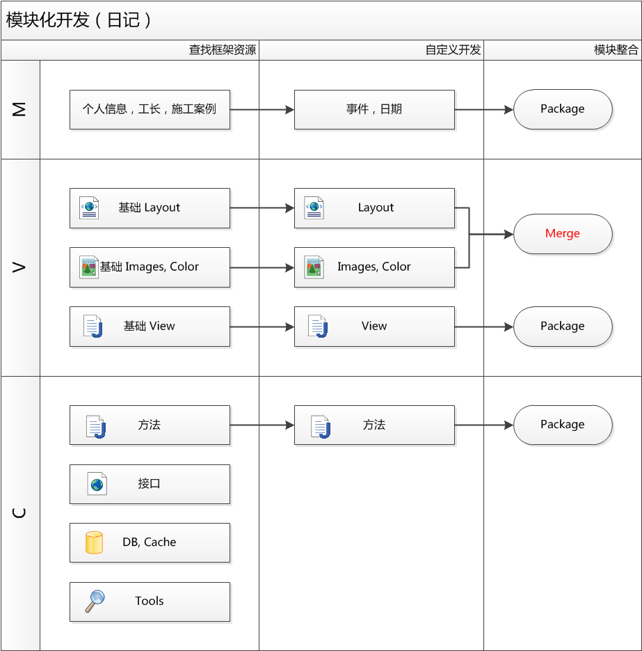
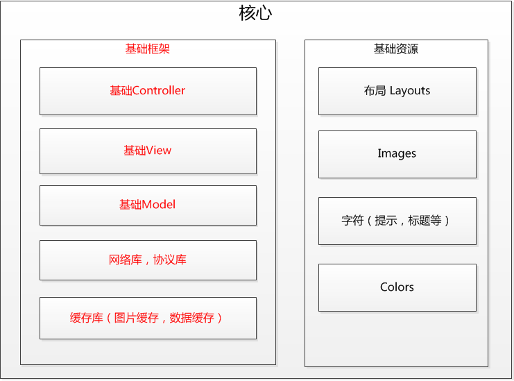
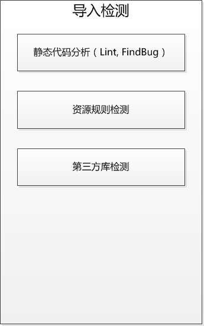

#Module 说明

##开发环境：

- Android Studio
- Gradle
- Android SDK 6.0

##开发流程

以“日记”为例，模块开发时，需要借鉴核心模块中的各种功能，以此为基础进行开发。之后导入的方式


##核心模块
- 按照MVC分为 基础的Controller, View, Model。提供核心SDK的支持。
- 基础库类
- 工具库




##导入


##开发说明

#### 包名

- 定义包名，如abc. 之后本模块所有均放在此包中，及 com.sinagz.abc
- 按照MVC，在包中适当分包，如 com.sinagz.abc.view

#### Class

- 所有的View需继承自核心中的 BaseView
- 所有的Manager 需继承自核心中的 BaseManager
- 所有的JSON 解析需继承自核心中的 BaseParser
- 网络请求，需调用核心库 HttpUtil
- 图片缓存, 需调用核心库 ImageCacheUtil
- DB, 需调用核心库 DatabaseUtil
- 缓存, 需调用核心库 CacheUtil

####资源

- 资源-布局, 文件开头需以 “包名_”开头，如 “abc_home.xml”
- 资源-切图, 文件开头需以 “包名_”开头，如 “abc_image.xml”
- 资源-字符&颜色, 文件开头需以 “包名_”开头，如 “abc_colors.xml”

##代码规范

####命名规则
全部驼峰命名,头一个字母小写，以后每个内部单词的头一个字母大写。

- package
包名全部由小写的ASCII字母组成，用“.”分隔。

- class
类名应当是名词。应当使你的类名简单和具有说明性。用完整的英语单词或约定俗成的简写命名类名。
	e.g.
``` JAVA
public class CommonUtils
```

- interface
接口名应当是名词。应当使你的接口名简单和具有说明性。用完整的英语单词或约定俗成的简写命名接口名。建议接口名以大写的I字母开头。
e.g.
``` JAVA
public interface ITicketManagement
```

- 常量的命名
Java 里的常量，是用static final 修饰的，应该用全大写加下划线命名，并且尽量指出完整含义。
e.g.
``` JAVA
static final String TAG="ClassName ";
```

- 方法的参数
和变量的命名规范一致，且应使用有意义的参数命名，如果可能的话，使用和要赋值的字段一样的名字。
e.g.
``` JAVA
public void setCounter(int appSize){
	this.mAppSize = appSize;
}
```

- 方法命名
方法的命名应当使用动词，在方法名的选择上应意义明确便于记忆。
对于属性的存取方法，应使用getXXX()和setXXX()名称，以isXXX()，hasXXX()来命名返回值为boolean 类型的方法。
e.g.
``` JAVA
public boolean isNetworkAvailable(Context context) {}
```

- 一般命名注意事项
用有意义的名字命名变量。首先，用完整的英语单词或约定俗成的简写命名变量。
e.g. `firstName`, `zipCode`
用复数命名Collection 类变量。Collection 包括数组，Vector 等。命名时使用复数：
e.g. `customers`, `classmates`


####编写风格

对所有诸如if-else，while，for，try-catch结构的控制语句都使用大括号，即使是单个语句，只要它是控制结构的一部分。
e.g.
``` JAVA
if (condition) {
	do something.
} else{
	do something.
}
```

##其他

需要Application 的时候使用App.getContext();
